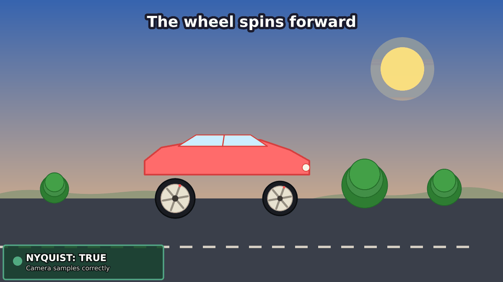

# NMR Concepts Visualized

> **See the signal. Understand the math.**


Python visualizations for **NMR, digital signal processing, and computational chemical data analysis** — built to make complex concepts easier to see, understand, and communicate.

This project explores the computational foundations behind modern NMR analysis through reproducible visual experiments.

The focus is not animation for its own sake.

**It is about making the underlying signal, mathematics, and computational reasoning visible.**

---

## 🎬 Visualizations

The repository is a growing collection of self-contained visualizations covering concepts relevant to:

* **NMR signal acquisition and processing**
* **Digital signal processing**
* **Fourier analysis**
* **Sampling and frequency-domain behavior**
* **Signal transformations and artifacts**
* **Computational analysis of chemical data**
* **Machine learning concepts relevant to scientific data**

A single concept may be explored through multiple visualizations, allowing the same underlying idea to be understood from different perspectives.

### Current examples

#### Nyquist Aliasing — Wagon Wheel Effect



A visual demonstration of sampling and aliasing — connecting an intuitive physical phenomenon to the mathematics underlying digital signal processing and NMR spectroscopy.

→ **[Code + full breakdown](./02-nyquist-aliasing/)**

---

## 🧠 Why this project?

Scientific computing often hides the most important ideas behind equations, software interfaces, and processed outputs.

In NMR, a spectrum is the result of a computational pipeline:

```text
Physical signal
      ↓
   Sampling
      ↓
 Digital data
      ↓
 Signal processing
      ↓
 Frequency domain
      ↓
   Spectrum
      ↓
 Interpretation
```

Each stage contains mathematical assumptions and computational decisions.

Understanding those decisions is essential when moving from simply **using analytical software** toward understanding, developing, and validating computational methods.

This repository is an attempt to make that reasoning more intuitive.

---

## 🔬 Research Context

The project sits within a broader interest in:

**Computational Chemical Data Analysis**

with a particular focus on:

**NMR × DSP × ML**

and related computational approaches for chemical and scientific data.

The visualizations are intended to complement deeper work in:

* NMR data processing
* signal processing
* computational chemistry
* machine learning for chemical data
* quantitative analysis
* reproducible scientific workflows

The goal is to connect **chemical understanding** with **computational methods** rather than treating them as separate disciplines.

---

## 📁 Files & Structure

Each visualization is kept as a self-contained unit so that it can be explored, reproduced, or reused independently.

```text
nmr-concepts-visualized/
│
├── 01-...
│   ├── *.py
│   ├── *.gif
│   └── README.md
│
├── 02-nyquist-aliasing/
│   ├── nyquist_car_v4.py
│   ├── nyquist_wheel.gif
│   └── README.md
│
├── ...
│
└── README.md
```

The repository will grow organically.

The numbering reflects the order in which visualizations are added — **not a fixed curriculum or predetermined publication sequence**.

New concepts may be added whenever they provide a useful way to visualize an important idea in NMR, DSP, computational chemistry, or related scientific data analysis.

---

## ⚙️ Requirements

Each visualization has its own README with the exact dependencies and instructions required to reproduce it.

Common dependencies include:

```bash
pip install matplotlib numpy pillow
```

---

## 🧪 Reproducibility

The visualizations are designed to be generated directly from Python rather than being static illustrations.

Where applicable, each folder contains:

* source code
* generated visualization
* explanation of the underlying concept
* dependencies
* reproduction instructions

The aim is to keep the relationship between **concept → code → visualization** transparent.

---

## 🌐 Origin

These visualizations grew out of work on **[nmrx.ir](https://nmrx.ir)**, an open-source NMR analysis platform.

While working with NMR processing and computational analysis, concepts such as Fourier transformation, phase correction, baseline correction, peak analysis, and signal processing repeatedly raised the same question:

**What is actually happening to the data underneath the software interface?**

Visualization became a useful way to answer that question.

This repository grew from that process.

---

## 🧭 Broader Direction

This project is part of a broader research-oriented path toward **computational analysis of chemical data**.

The central intersection is:

```text
          Chemistry
              │
              ▼
             NMR
              │
        ┌─────┴─────┐
        ▼           ▼
       DSP          ML
        │           │
        └─────┬─────┘
              ▼
 Computational Chemical
       Data Analysis
```

The emphasis is on building practical understanding across the full chain:

**chemical problem → scientific data → signal processing → computational analysis → interpretable result**

---

## 👨‍🔬 Author

**Seyyed Mostafa Moosavi**

Chemist focused on **NMR signal processing, computational chemical data analysis, and chemoinformatics**.

Building **[nmrx.ir](https://nmrx.ir)** as an open-source NMR analysis platform.

**[GitHub](https://github.com/HHo2050)** · **[LinkedIn](https://www.linkedin.com/in/mostafamousavi-nmrx/)** · **[nmrx.ir](https://nmrx.ir)**

---

## 📜 License

This project is released under the **MIT License**.

---

### Built with Python · NMR · DSP · ML · Scientific Computing

> **See the signal. Understand the math.**
